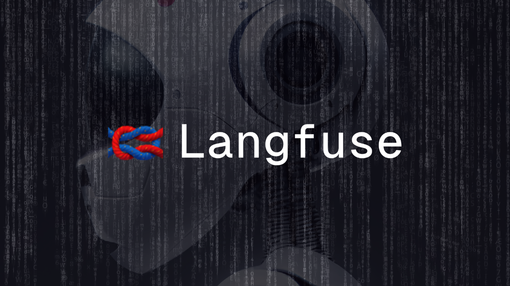

<div align="left">

[](https://langfuse.com)

# [Langfuse](https://langfuse.com)<a id="langfuse"></a>

## Authentication<a id="authentication"></a>

Authenticate with the API using Basic Auth, get API keys in the project settings:

- username: Langfuse Public Key
- password: Langfuse Secret Key

</div>

## Table of Contents<a id="table-of-contents"></a>

<!-- toc -->

- [Installation](#installation)
- [Getting Started](#getting-started)
- [Reference](#reference)
  * [`langfuse.datasetItems.create`](#langfusedatasetitemscreate)
  * [`langfuse.datasetItems.get`](#langfusedatasetitemsget)
  * [`langfuse.datasetRunItems.create`](#langfusedatasetrunitemscreate)
  * [`langfuse.datasets.create`](#langfusedatasetscreate)
  * [`langfuse.datasets.get`](#langfusedatasetsget)
  * [`langfuse.datasets.getRuns`](#langfusedatasetsgetruns)
  * [`langfuse.health.health`](#langfusehealthhealth)
  * [`langfuse.ingestion.batch`](#langfuseingestionbatch)
  * [`langfuse.metrics.daily`](#langfusemetricsdaily)
  * [`langfuse.observations.get`](#langfuseobservationsget)
  * [`langfuse.observations.getMany`](#langfuseobservationsgetmany)
  * [`langfuse.projects.get`](#langfuseprojectsget)
  * [`langfuse.prompts.create`](#langfusepromptscreate)
  * [`langfuse.prompts.get`](#langfusepromptsget)
  * [`langfuse.score.create`](#langfusescorecreate)
  * [`langfuse.score.delete`](#langfusescoredelete)
  * [`langfuse.score.get`](#langfusescoreget)
  * [`langfuse.score.getById`](#langfusescoregetbyid)
  * [`langfuse.sessions.get`](#langfusesessionsget)
  * [`langfuse.trace.get`](#langfusetraceget)
  * [`langfuse.trace.list`](#langfusetracelist)

<!-- tocstop -->

## Installation<a id="installation"></a>
<div align="center">
  <a href="https://konfigthis.com/sdk-sign-up?company=Langfuse&language=TypeScript">
    
  </a>
</div>

## Getting Started<a id="getting-started"></a>

```typescript
import { Langfuse } from "langfuse-typescript-sdk";

const langfuse = new Langfuse({
  // Defining the base path is optional and defaults to https://cloud.langfuse.com
  // basePath: "https://cloud.langfuse.com",
});

const createResponse = await langfuse.datasetItems.create({
  datasetName: "datasetName_example",
  input: null,
});

console.log(createResponse);
```

## Reference<a id="reference"></a>


### `langfuse.datasetItems.create`<a id="langfusedatasetitemscreate"></a>

Create a dataset item

#### 🛠️ Usage<a id="🛠️-usage"></a>

```typescript
const createResponse = await langfuse.datasetItems.create({
  datasetName: "datasetName_example",
  input: null,
});
```

#### ⚙️ Parameters<a id="⚙️-parameters"></a>

##### datasetName: `string`<a id="datasetname-string"></a>

##### input: `any`<a id="input-any"></a>

##### expectedOutput: `any`<a id="expectedoutput-any"></a>

##### id: `string`<a id="id-string"></a>

Dataset items are upserted on their id

#### 🔄 Return<a id="🔄-return"></a>

[DatasetItem](./models/dataset-item.ts)

#### 🌐 Endpoint<a id="🌐-endpoint"></a>

`/api/public/dataset-items` `POST`

[🔙 **Back to Table of Contents**](#table-of-contents)

---


### `langfuse.datasetItems.get`<a id="langfusedatasetitemsget"></a>

Get a dataset item

#### 🛠️ Usage<a id="🛠️-usage"></a>

```typescript
const getResponse = await langfuse.datasetItems.get({
  id: "id_example",
});
```

#### ⚙️ Parameters<a id="⚙️-parameters"></a>

##### id: `string`<a id="id-string"></a>

#### 🔄 Return<a id="🔄-return"></a>

[DatasetItem](./models/dataset-item.ts)

#### 🌐 Endpoint<a id="🌐-endpoint"></a>

`/api/public/dataset-items/{id}` `GET`

[🔙 **Back to Table of Contents**](#table-of-contents)

---


### `langfuse.datasetRunItems.create`<a id="langfusedatasetrunitemscreate"></a>

Create a dataset run item

#### 🛠️ Usage<a id="🛠️-usage"></a>

```typescript
const createResponse = await langfuse.datasetRunItems.create({
  runName: "runName_example",
  datasetItemId: "datasetItemId_example",
  observationId: "observationId_example",
});
```

#### ⚙️ Parameters<a id="⚙️-parameters"></a>

##### runName: `string`<a id="runname-string"></a>

##### datasetItemId: `string`<a id="datasetitemid-string"></a>

##### observationId: `string`<a id="observationid-string"></a>

#### 🔄 Return<a id="🔄-return"></a>

[DatasetRunItem](./models/dataset-run-item.ts)

#### 🌐 Endpoint<a id="🌐-endpoint"></a>

`/api/public/dataset-run-items` `POST`

[🔙 **Back to Table of Contents**](#table-of-contents)

---


### `langfuse.datasets.create`<a id="langfusedatasetscreate"></a>

Create a dataset

#### 🛠️ Usage<a id="🛠️-usage"></a>

```typescript
const createResponse = await langfuse.datasets.create({
  name: "name_example",
});
```

#### ⚙️ Parameters<a id="⚙️-parameters"></a>

##### name: `string`<a id="name-string"></a>

#### 🔄 Return<a id="🔄-return"></a>

[Dataset](./models/dataset.ts)

#### 🌐 Endpoint<a id="🌐-endpoint"></a>

`/api/public/datasets` `POST`

[🔙 **Back to Table of Contents**](#table-of-contents)

---


### `langfuse.datasets.get`<a id="langfusedatasetsget"></a>

Get a dataset and its items

#### 🛠️ Usage<a id="🛠️-usage"></a>

```typescript
const getResponse = await langfuse.datasets.get({
  datasetName: "datasetName_example",
});
```

#### ⚙️ Parameters<a id="⚙️-parameters"></a>

##### datasetName: `string`<a id="datasetname-string"></a>

#### 🔄 Return<a id="🔄-return"></a>

[Dataset](./models/dataset.ts)

#### 🌐 Endpoint<a id="🌐-endpoint"></a>

`/api/public/datasets/{datasetName}` `GET`

[🔙 **Back to Table of Contents**](#table-of-contents)

---


### `langfuse.datasets.getRuns`<a id="langfusedatasetsgetruns"></a>

Get a dataset run and its items

#### 🛠️ Usage<a id="🛠️-usage"></a>

```typescript
const getRunsResponse = await langfuse.datasets.getRuns({
  datasetName: "datasetName_example",
  runName: "runName_example",
});
```

#### ⚙️ Parameters<a id="⚙️-parameters"></a>

##### datasetName: `string`<a id="datasetname-string"></a>

##### runName: `string`<a id="runname-string"></a>

#### 🔄 Return<a id="🔄-return"></a>

[DatasetRun](./models/dataset-run.ts)

#### 🌐 Endpoint<a id="🌐-endpoint"></a>

`/api/public/datasets/{datasetName}/runs/{runName}` `GET`

[🔙 **Back to Table of Contents**](#table-of-contents)

---


### `langfuse.health.health`<a id="langfusehealthhealth"></a>

Check health of API and database

#### 🛠️ Usage<a id="🛠️-usage"></a>

```typescript
const healthResponse = await langfuse.health.health();
```

#### 🔄 Return<a id="🔄-return"></a>

[HealthResponse](./models/health-response.ts)

#### 🌐 Endpoint<a id="🌐-endpoint"></a>

`/api/public/health` `GET`

[🔙 **Back to Table of Contents**](#table-of-contents)

---


### `langfuse.ingestion.batch`<a id="langfuseingestionbatch"></a>

Batched ingestion for Langfuse Tracing

#### 🛠️ Usage<a id="🛠️-usage"></a>

```typescript
const batchResponse = await langfuse.ingestion.batch({
  batch: [null],
});
```

#### ⚙️ Parameters<a id="⚙️-parameters"></a>

##### batch: [`IngestionEvent`](./models/ingestion-event.ts)[]<a id="batch-ingestioneventmodelsingestion-eventts"></a>

#### 🔄 Return<a id="🔄-return"></a>

[IngestionResponse](./models/ingestion-response.ts)

#### 🌐 Endpoint<a id="🌐-endpoint"></a>

`/api/public/ingestion` `POST`

[🔙 **Back to Table of Contents**](#table-of-contents)

---


### `langfuse.metrics.daily`<a id="langfusemetricsdaily"></a>

Get daily metrics of the Langfuse project

#### 🛠️ Usage<a id="🛠️-usage"></a>

```typescript
const dailyResponse = await langfuse.metrics.daily({});
```

#### ⚙️ Parameters<a id="⚙️-parameters"></a>

##### page: `number`<a id="page-number"></a>

##### limit: `number`<a id="limit-number"></a>

##### traceName: `string`<a id="tracename-string"></a>

Optional filter by the name of the trace

##### userId: `string`<a id="userid-string"></a>

Optional filter by the userId associated with the trace

##### tags: `string`[]<a id="tags-string"></a>

Optional filter for metrics where traces include all of these tags

#### 🔄 Return<a id="🔄-return"></a>

[DailyMetrics](./models/daily-metrics.ts)

#### 🌐 Endpoint<a id="🌐-endpoint"></a>

`/api/public/metrics/daily` `GET`

[🔙 **Back to Table of Contents**](#table-of-contents)

---


### `langfuse.observations.get`<a id="langfuseobservationsget"></a>

Get a observation

#### 🛠️ Usage<a id="🛠️-usage"></a>

```typescript
const getResponse = await langfuse.observations.get({
  observationId: "observationId_example",
});
```

#### ⚙️ Parameters<a id="⚙️-parameters"></a>

##### observationId: `string`<a id="observationid-string"></a>

The unique langfuse identifier of an observation, can be an event, span or generation

#### 🔄 Return<a id="🔄-return"></a>

[Observation](./models/observation.ts)

#### 🌐 Endpoint<a id="🌐-endpoint"></a>

`/api/public/observations/{observationId}` `GET`

[🔙 **Back to Table of Contents**](#table-of-contents)

---


### `langfuse.observations.getMany`<a id="langfuseobservationsgetmany"></a>

Get a list of observations

#### 🛠️ Usage<a id="🛠️-usage"></a>

```typescript
const getManyResponse = await langfuse.observations.getMany({});
```

#### ⚙️ Parameters<a id="⚙️-parameters"></a>

##### page: `number`<a id="page-number"></a>

##### limit: `number`<a id="limit-number"></a>

##### name: `string`<a id="name-string"></a>

##### userId: `string`<a id="userid-string"></a>

##### type: `string`<a id="type-string"></a>

##### traceId: `string`<a id="traceid-string"></a>

##### parentObservationId: `string`<a id="parentobservationid-string"></a>

#### 🔄 Return<a id="🔄-return"></a>

[ObservationsViews](./models/observations-views.ts)

#### 🌐 Endpoint<a id="🌐-endpoint"></a>

`/api/public/observations` `GET`

[🔙 **Back to Table of Contents**](#table-of-contents)

---


### `langfuse.projects.get`<a id="langfuseprojectsget"></a>

Get Project associated with API key

#### 🛠️ Usage<a id="🛠️-usage"></a>

```typescript
const getResponse = await langfuse.projects.get();
```

#### 🔄 Return<a id="🔄-return"></a>

[Projects](./models/projects.ts)

#### 🌐 Endpoint<a id="🌐-endpoint"></a>

`/api/public/projects` `GET`

[🔙 **Back to Table of Contents**](#table-of-contents)

---


### `langfuse.prompts.create`<a id="langfusepromptscreate"></a>

Create a prompt

#### 🛠️ Usage<a id="🛠️-usage"></a>

```typescript
const createResponse = await langfuse.prompts.create({
  name: "name_example",
  isActive: true,
  prompt: "prompt_example",
});
```

#### ⚙️ Parameters<a id="⚙️-parameters"></a>

##### name: `string`<a id="name-string"></a>

##### isActive: `boolean`<a id="isactive-boolean"></a>

Should the prompt be promoted to production immediately?

##### prompt: `string`<a id="prompt-string"></a>

##### config: `any`<a id="config-any"></a>

#### 🔄 Return<a id="🔄-return"></a>

[Prompt](./models/prompt.ts)

#### 🌐 Endpoint<a id="🌐-endpoint"></a>

`/api/public/prompts` `POST`

[🔙 **Back to Table of Contents**](#table-of-contents)

---


### `langfuse.prompts.get`<a id="langfusepromptsget"></a>

Get a prompt

#### 🛠️ Usage<a id="🛠️-usage"></a>

```typescript
const getResponse = await langfuse.prompts.get({
  name: "name_example",
});
```

#### ⚙️ Parameters<a id="⚙️-parameters"></a>

##### name: `string`<a id="name-string"></a>

##### version: `number`<a id="version-number"></a>

#### 🔄 Return<a id="🔄-return"></a>

[Prompt](./models/prompt.ts)

#### 🌐 Endpoint<a id="🌐-endpoint"></a>

`/api/public/prompts` `GET`

[🔙 **Back to Table of Contents**](#table-of-contents)

---


### `langfuse.score.create`<a id="langfusescorecreate"></a>

Create a score

#### 🛠️ Usage<a id="🛠️-usage"></a>

```typescript
const createResponse = await langfuse.score.create({
  traceId: "traceId_example",
  name: "name_example",
  value: 3.14,
});
```

#### ⚙️ Parameters<a id="⚙️-parameters"></a>

##### traceId: `string`<a id="traceid-string"></a>

##### name: `string`<a id="name-string"></a>

##### value: `number`<a id="value-number"></a>

##### id: `string`<a id="id-string"></a>

##### observationId: `string`<a id="observationid-string"></a>

##### comment: `string`<a id="comment-string"></a>

#### 🔄 Return<a id="🔄-return"></a>

[Score](./models/score.ts)

#### 🌐 Endpoint<a id="🌐-endpoint"></a>

`/api/public/scores` `POST`

[🔙 **Back to Table of Contents**](#table-of-contents)

---


### `langfuse.score.delete`<a id="langfusescoredelete"></a>

Delete a score

#### 🛠️ Usage<a id="🛠️-usage"></a>

```typescript
const deleteResponse = await langfuse.score.delete({
  scoreId: "scoreId_example",
});
```

#### ⚙️ Parameters<a id="⚙️-parameters"></a>

##### scoreId: `string`<a id="scoreid-string"></a>

The unique langfuse identifier of a score

#### 🌐 Endpoint<a id="🌐-endpoint"></a>

`/api/public/scores/{scoreId}` `DELETE`

[🔙 **Back to Table of Contents**](#table-of-contents)

---


### `langfuse.score.get`<a id="langfusescoreget"></a>

Get a list of scores

#### 🛠️ Usage<a id="🛠️-usage"></a>

```typescript
const getResponse = await langfuse.score.get({});
```

#### ⚙️ Parameters<a id="⚙️-parameters"></a>

##### page: `number`<a id="page-number"></a>

##### limit: `number`<a id="limit-number"></a>

##### userId: `string`<a id="userid-string"></a>

##### name: `string`<a id="name-string"></a>

#### 🔄 Return<a id="🔄-return"></a>

[Scores](./models/scores.ts)

#### 🌐 Endpoint<a id="🌐-endpoint"></a>

`/api/public/scores` `GET`

[🔙 **Back to Table of Contents**](#table-of-contents)

---


### `langfuse.score.getById`<a id="langfusescoregetbyid"></a>

Get a score

#### 🛠️ Usage<a id="🛠️-usage"></a>

```typescript
const getByIdResponse = await langfuse.score.getById({
  scoreId: "scoreId_example",
});
```

#### ⚙️ Parameters<a id="⚙️-parameters"></a>

##### scoreId: `string`<a id="scoreid-string"></a>

The unique langfuse identifier of a score

#### 🔄 Return<a id="🔄-return"></a>

[Score](./models/score.ts)

#### 🌐 Endpoint<a id="🌐-endpoint"></a>

`/api/public/scores/{scoreId}` `GET`

[🔙 **Back to Table of Contents**](#table-of-contents)

---


### `langfuse.sessions.get`<a id="langfusesessionsget"></a>

Get a session

#### 🛠️ Usage<a id="🛠️-usage"></a>

```typescript
const getResponse = await langfuse.sessions.get({
  sessionId: "sessionId_example",
});
```

#### ⚙️ Parameters<a id="⚙️-parameters"></a>

##### sessionId: `string`<a id="sessionid-string"></a>

The unique id of a session

#### 🔄 Return<a id="🔄-return"></a>

[Session](./models/session.ts)

#### 🌐 Endpoint<a id="🌐-endpoint"></a>

`/api/public/sessions/{sessionId}` `GET`

[🔙 **Back to Table of Contents**](#table-of-contents)

---


### `langfuse.trace.get`<a id="langfusetraceget"></a>

Get a specific trace

#### 🛠️ Usage<a id="🛠️-usage"></a>

```typescript
const getResponse = await langfuse.trace.get({
  traceId: "traceId_example",
});
```

#### ⚙️ Parameters<a id="⚙️-parameters"></a>

##### traceId: `string`<a id="traceid-string"></a>

The unique langfuse identifier of a trace

#### 🔄 Return<a id="🔄-return"></a>

[Trace](./models/trace.ts)

#### 🌐 Endpoint<a id="🌐-endpoint"></a>

`/api/public/traces/{traceId}` `GET`

[🔙 **Back to Table of Contents**](#table-of-contents)

---


### `langfuse.trace.list`<a id="langfusetracelist"></a>

Get list of traces

#### 🛠️ Usage<a id="🛠️-usage"></a>

```typescript
const listResponse = await langfuse.trace.list({});
```

#### ⚙️ Parameters<a id="⚙️-parameters"></a>

##### page: `number`<a id="page-number"></a>

##### limit: `number`<a id="limit-number"></a>

##### userId: `string`<a id="userid-string"></a>

##### name: `string`<a id="name-string"></a>

##### orderBy: `string`<a id="orderby-string"></a>

Format of the string [field].[asc/desc]. Fields: id, timestamp, name, userId, release, version, public, bookmarked, sessionId. Example: timestamp.asc

##### tags: `string`[]<a id="tags-string"></a>

Only traces that include all of these tags will be returned.

#### 🔄 Return<a id="🔄-return"></a>

[Traces](./models/traces.ts)

#### 🌐 Endpoint<a id="🌐-endpoint"></a>

`/api/public/traces` `GET`

[🔙 **Back to Table of Contents**](#table-of-contents)

---


## Author<a id="author"></a>
This TypeScript package is automatically generated by [Konfig](https://konfigthis.com)
